# Cryptojacking Detection System - Research Paper Template & Visual Architecture

## 1. Visual Architecture Diagrams (Mermaid Format)

### 1.1 High-Level System Architecture

```mermaid
graph TB
    subgraph Browser["🌐 Browser (User Machine)"]
        EXT["🔌 Chrome Extension<br/>(Manifest v3)"]
        POPUP["📋 Popup UI<br/>(popup.html)"]
        BG["⚙️ Service Worker<br/>(background.js)"]
        EXT --> POPUP
        EXT --> BG
    end
    
    subgraph Server["🖥️ Backend Server<br/>(Node.js)"]
        EXPRESS["⚡ Express.js<br/>(Port 3000)"]
        MONITOR["🎭 Playwright<br/>(Web Monitoring)"]
        METRICS["📊 psutil<br/>(System Metrics)"]
        EXPRESS --> MONITOR
        EXPRESS --> METRICS
    end
    
    subgraph ML["🤖 ML Inference"]
        CPU_MODEL["🔴 CPU Model<br/>(Random Forest<br/>34 features)"]
        WEB_MODEL["🔵 Web Model<br/>(Random Forest<br/>7 features)"]
    end
    
    subgraph Storage["💾 Storage"]
        DATASET["📁 dataset_enriched.json<br/>(Results)"]
        MODELS["🗂️ .pkl Files<br/>(Models)"]
    end
    
    EXT -->|"POST /tabs<br/>(URLs)"| EXPRESS
    MONITOR --> ML
    METRICS --> ML
    CPU_MODEL --> DATASET
    WEB_MODEL --> DATASET
    MODELS --> CPU_MODEL
    MODELS --> WEB_MODEL
    EXPRESS -->|"JSON Response"| EXT
    POPUP -->|"Display Results"| Browser
    
    style Browser fill:#e1f5ff
    style Server fill:#fff3e0
    style ML fill:#f3e5f5
    style Storage fill:#e8f5e9
```



### 1.2 Detection Pipeline Flow

```mermaid
flowchart TD
    A["📥 Receive URL from<br/>Browser Extension"] --> B["🌐 Launch Playwright<br/>Headless Browser"]
    B --> C["💾 Collect 7 Web<br/>Behavior Features"]
    B --> D["📊 Collect 34 System<br/>Metrics via psutil"]
    
    C --> E["🔴 STAGE 1:<br/>CPU Model Inference<br/>(34 features)"]
    D --> E
    
    E --> F{"CPU Model<br/>Prediction?"}
    F -->|"0 = Benign"| G["✅ FINAL: BENIGN<br/>(Return Result)"]
    F -->|"1 = Suspicious"| H["🔵 STAGE 2:<br/>Web Model Inference<br/>(7 features)"]
    
    C --> H
    H --> I{"Web Model<br/>Prediction?"}
    I -->|"0 = Benign"| J["✅ FINAL: BENIGN<br/>(Likely False Positive)"]
    I -->|"1 = Crypto"| K["⚠️ FINAL: CRYPTOJACKING<br/>DETECTED"]
    
    G --> L["💾 Save to<br/>dataset_enriched.json"]
    J --> L
    K --> L
    
    L --> M["📤 Return JSON Response<br/>to Browser Extension"]
    M --> N["📊 Display Results<br/>in Popup UI"]
    
    style A fill:#bbdefb
    style E fill:#ffe0b2
    style H fill:#f8bbd0
    style G fill:#c8e6c9
    style K fill:#ffccbc
    style L fill:#e1bee7
```



### 1.3 Data Structures


### 1.4 Deployment Architecture


---

## 2. Research Paper Outline & Prompts for ChatGPT

### Section 1: Abstract

**What to tell ChatGPT:**
```
"I'm writing a research paper on cryptojacking detection using machine learning. 
Here are the key details:

PROJECT SPECIFICS:
- Chrome Extension that monitors browser tabs for cryptojacking
- Hybrid ML approach combining CPU-level + web-level analysis
- Two-stage detection pipeline (CPU model → Web model)
- CPU Model: Random Forest with 34 system metrics features
- Web Model: Random Forest with 7 web behavior features
- Accuracy: Web model 99.875% on test set
- Real-time analysis on active browser tabs

I need help writing the abstract. Please include:
1. Problem statement (cryptojacking threat)
2. Our solution (hybrid ML detection)
3. Key innovation (two-stage ensemble)
4. Results (accuracy metrics)
5. Significance (practical web security tool)
"
```

### Section 2: Introduction

**Prompt:**
```
"For my cryptojacking detection paper, write an introduction (2-3 pages) that covers:

1. BACKGROUND
   - What is cryptojacking? (definition, examples)
   - Historical attacks/prevalence
   - Economic impact on users and organizations
   - Current detection methods and their limitations

2. MOTIVATION
   - Why existing solutions are insufficient
   - Gap in client-side, real-time detection
   - Browser-level monitoring advantages

3. OUR APPROACH PREVIEW
   - Mention we use machine learning for detection
   - Hybrid CPU + Web behavior analysis
   - Integration with Chrome extension for accessibility

4. RESEARCH QUESTIONS
   - Can we detect cryptojacking through resource anomalies?
   - Are web behavior patterns reliable indicators?
   - Can a two-stage model improve accuracy?

5. CONTRIBUTIONS
   - Novel hybrid detection approach
   - Public implementation
   - Performance metrics

Please use academic tone and include 5-10 relevant citations for cryptojacking."
```

### Section 3: Related Work

**Prompt:**
```
"Write a 'Related Work' section for my cryptojacking detection paper covering:

1. CRYPTOJACKING DETECTION TECHNIQUES
   - Signature-based detection
   - Heuristic-based approaches
   - Machine learning methods (existing papers)
   - Network-based detection
   - Browser-based detection

2. MACHINE LEARNING FOR MALWARE DETECTION
   - Random Forest applications in security
   - Ensemble methods for anomaly detection
   - Feature engineering for system metrics
   - Web behavior analysis

3. RESOURCE MONITORING
   - CPU/Memory anomaly detection
   - Process analysis techniques
   - System metric collection tools

4. WEB SECURITY & JAVASCRIPT ANALYSIS
   - Dangerous API detection
   - WebWorker monitoring
   - WASM execution tracking
   - Browser instrumentation

5. OUR POSITIONING
   - How our work differs
   - Novel contributions
   - Complementary to existing approaches

Format: 4-5 pages with 15-20 citations"
```

### Section 4: Methodology

**Prompt:**
```
"Write the 'Methodology' section for my cryptojacking detection system. Include:

DATA COLLECTION (1 page):
- Chrome Extension role (passive tab monitoring)
- System metrics collection method (psutil)
  - CPU: idle, user, system, total usage
  - Memory: available, used, buffered, cached
  - Network I/O: bytes sent/received, packets, errors
  - Disk I/O: read/write bytes and times
  - Process load: 1/5/15min averages
  - System: uptime, CPU frequency, core count
- Web behavior collection (Playwright headless browser)
  - API hooking technique
  - WebSocket detection
  - WebAssembly compilation tracking
  - Cryptographic function detection
  - Web Worker creation
  - Message loop activity
  - Parallel function execution
- Monitoring duration: 12 seconds per URL
- Feature count: 34 system + 7 web = 41 total

DATASET (1 page):
- CPU Model Training Data:
  - Normal system behavior dataset
  - Abnormal/cryptojacking system metrics
  - Combined and preprocessed
  - Feature normalization: StandardScaler
  - Train-test split: 80-20
- Web Model Training Data:
  - Benign website dataset (benign_set.csv)
  - Crypto-mining website dataset (crypto_set.csv)
  - Total samples: ~4000
  - Features: 7 behavioral indicators
  - Train-test split: 80-20

MACHINE LEARNING MODELS (1.5 pages):
- Algorithm: Random Forest Classifier
- Rationale: Ensemble robustness, feature importance, interpretability
- CPU Model Configuration:
  - Input: 34 features
  - n_estimators: 100 trees
  - Feature scaling: StandardScaler
  - Hyperparameters tuning method
- Web Model Configuration:
  - Input: 7 features
  - n_estimators: 100 trees
  - No scaling needed (binary/normalized features)
  - Cross-validation: k-fold

PIPELINE ARCHITECTURE (1 page):
- Two-stage detection design:
  - Stage 1: CPU model (first-pass filter)
  - Decision gate: If benign, stop (optimization)
  - Stage 2: Web model (confirmation stage)
- Voting mechanism
- Threshold settings
- Decision rules for final verdict

IMPLEMENTATION (0.5 pages):
- Technologies: Node.js, Express, Playwright, scikit-learn
- Real-time inference: Sub-second for both models
- Local processing: No cloud transmission"
```

### Section 5: Experimental Results

**Prompt:**
```
"Write the 'Results' section with:

1. CPU MODEL PERFORMANCE
   - Training accuracy: [insert your value]
   - Test accuracy: [insert your value]
   - Precision, Recall, F1-score
   - Confusion matrix results
   - ROC-AUC score
   - Feature importance analysis (top 10 features)

2. WEB MODEL PERFORMANCE
   - Training accuracy: ~100%
   - Test accuracy: 99.875%
   - Precision: [calculate from data]
   - Recall: [calculate from data]
   - F1-score: [calculate from data]
   - Confusion matrix
   - Feature importance for cryptojacking indicators

3. ENSEMBLE SYSTEM PERFORMANCE
   - Overall accuracy on test set
   - False positive rate (important!)
   - False negative rate
   - Detection latency per URL (~13-15 sec)
   - Comparison: Stage 1 only vs. Stage 2 added value

4. CROSS-VALIDATION RESULTS
   - k-fold results (show consistency)
   - Variance across folds

5. ABLATION STUDY
   - Impact of feature sets
   - CPU-only vs Web-only vs Ensemble
   - Effect of individual features

6. REAL-WORLD TESTING
   - URLs tested (if available)
   - Known cryptojacking sites detected
   - Benign sites cleared
   - Edge cases/limitations

Include:
- Tables with numerical results
- Graphs (ROC curves, confusion matrices)
- Statistical significance testing"
```

### Section 6: Discussion

**Prompt:**
```
"Write a comprehensive 'Discussion' section covering:

1. KEY FINDINGS
   - What the results tell us
   - Comparison with baseline/related work
   - Explanation of high accuracy

2. ADVANTAGES OF HYBRID APPROACH
   - Why CPU + Web is better than single stage
   - Cost reduction of Stage 1 filtering
   - Reduced false positives vs single approach
   - Complementary signal sources

3. LIMITATIONS
   - Computational cost (12 sec per URL)
   - Limited to active tab monitoring
   - Chrome-specific (not Firefox, etc.)
   - Evasion techniques that could bypass detection
   - Feature engineering assumptions
   - Dataset bias (if any)

4. PRACTICAL DEPLOYMENT CHALLENGES
   - Browser extension limitations
   - User adoption barriers
   - Performance on low-end machines
   - Privacy considerations

5. FUTURE WORK
   - Cross-browser support
   - Multi-stage models
   - Federated learning
   - Adversarial robustness
   - Real-time dashboard
   - Integration with browser security features

6. REPRODUCIBILITY
   - Code availability: GitHub repo
   - Model checkpoints available
   - Dataset availability/licensing
   - Detailed hyperparameter documentation"
```

### Section 7: Conclusion

**Prompt:**
```
"Write a 'Conclusion' section (0.75-1 page) that:

1. SUMMARIZES CONTRIBUTIONS
   - Hybrid ML detection system
   - Implementation and deployment
   - Performance metrics
   - Open-source nature

2. IMPACT STATEMENT
   - Why this matters for end users
   - Protection against cryptojacking threat
   - Low-friction browser integration

3. VALIDATION
   - Proven effectiveness (99.875% web model accuracy)
   - Practical real-time performance
   - Cost-effective resource usage

4. BROADER IMPLICATIONS
   - Browser security ecosystem
   - ML for web security
   - User protection strategies

5. CALL TO ACTION
   - Adoption by security community
   - Future research directions
   - Community contributions welcome"
```

---

## 3. Sample Tables for Your Paper

### Table 1: Dataset Characteristics

```
┌──────────────────────┬──────────────┬──────────────┬──────────────┐
│ Dataset              │ Samples      │ Features     │ Labels       │
├──────────────────────┼──────────────┼──────────────┼──────────────┤
│ CPU Model Training   │ [TBD]        │ 34           │ Normal/Anom  │
│ CPU Model Testing    │ [TBD]        │ 34           │ Normal/Anom  │
├──────────────────────┼──────────────┼──────────────┼──────────────┤
│ Web Model Training   │ ~3200        │ 7            │ Benign/Crypto│
│ Web Model Testing    │ ~800         │ 7            │ Benign/Crypto│
└──────────────────────┴──────────────┴──────────────┴──────────────┘
```

### Table 2: Model Performance Comparison

```
┌─────────────────────┬──────────────┬──────────────┬──────────────┐
│ Metric              │ CPU Model    │ Web Model    │ Ensemble     │
├─────────────────────┼──────────────┼──────────────┼──────────────┤
│ Training Accuracy   │ [TBD]%       │ 100%         │ [TBD]%       │
│ Test Accuracy       │ [TBD]%       │ 99.875%      │ [TBD]%       │
│ Precision           │ [TBD]%       │ [TBD]%       │ [TBD]%       │
│ Recall              │ [TBD]%       │ [TBD]%       │ [TBD]%       │
│ F1-Score            │ [TBD]%       │ [TBD]%       │ [TBD]%       │
│ False Positive Rate  │ [TBD]%       │ [TBD]%       │ [TBD]%       │
│ False Negative Rate  │ [TBD]%       │ [TBD]%       │ [TBD]%       │
│ AUC-ROC             │ [TBD]%       │ [TBD]%       │ [TBD]%       │
│ Latency (avg)       │ ~100ms       │ ~10ms        │ ~110ms       │
└─────────────────────┴──────────────┴──────────────┴──────────────┘
```

### Table 3: Feature Importance (Top 10)

```
┌──────┬────────────────────────┬───────────────┐
│ Rank │ Feature (CPU Model)    │ Importance %  │
├──────┼────────────────────────┼───────────────┤
│ 1    │ [Top Feature]          │ [TBD]%        │
│ 2    │ [2nd Feature]          │ [TBD]%        │
│ 3    │ [3rd Feature]          │ [TBD]%        │
│ ... │ ...                    │ ...           │
│ 10   │ [10th Feature]         │ [TBD]%        │
└──────┴────────────────────────┴───────────────┘

┌──────┬────────────────────────┬───────────────┐
│ Rank │ Feature (Web Model)    │ Importance %  │
├──────┼────────────────────────┼───────────────┤
│ 1    │ websocket              │ [TBD]%        │
│ 2    │ wasm                   │ [TBD]%        │
│ 3    │ hash_function          │ [TBD]%        │
│ 4    │ webworkers             │ [TBD]%        │
│ 5    │ messageloop_load       │ [TBD]%        │
│ 6    │ postmessage_load       │ [TBD]%        │
│ 7    │ parallel_functions     │ [TBD]%        │
└──────┴────────────────────────┴───────────────┘
```

---

## 4. Key Talking Points for Your Paper

### Innovation & Novelty
- ✅ **Hybrid Approach**: Combines system-level (CPU) and web-level (behavioral) analysis
- ✅ **Two-Stage Pipeline**: Efficient resource usage through staged detection
- ✅ **Real-time Browser Integration**: Chrome extension for immediate detection
- ✅ **High Accuracy**: 99.875% on web model test set
- ✅ **Practical Implementation**: Fully functional, deployable system

### Technical Strengths
- Random Forest ensures interpretability (feature importance)
- Binary classification simplifies decision-making
- Ensemble voting reduces overfitting
- Modular design allows easy updates
- Local processing ensures user privacy

### Performance Metrics
- Detection latency: ~13-15 seconds per URL
- Web model test accuracy: 99.875%
- False positive minimization through two-stage gate
- Reduced computational cost vs monolithic single model

### Practical Impact
- Easy deployment via browser extension
- No server infrastructure required
- Protects non-technical users
- Complements existing security tools
- Extensible to other browser-based threats

---

## 5. Recommended Structure for Your Full Paper

```
1. Title & Abstract (1 page)
2. Introduction (2-3 pages)
3. Related Work (3-4 pages)
4. Methodology (3-4 pages)
   - Data Collection
   - Feature Engineering
   - Model Design
   - Evaluation Metrics
5. Experimental Results (2-3 pages)
   - Performance Metrics
   - Comparison Analysis
   - Statistical Significance
6. Discussion (2-3 pages)
   - Key Findings
   - Limitations
   - Future Work
7. Conclusion (0.75-1 page)
8. References (1-2 pages, 30-50 citations)
9. Appendices (Code snippets, detailed results)

Total: 15-20 pages
```

---

## 6. Best Practices for Academic Writing

1. **Use Formal Language**: Avoid contractions, casual phrases
2. **Active Voice**: "We developed a model" vs "A model was developed"
3. **Past Tense**: Describe what you did/found
4. **Present Tense**: For general truths, methodology descriptions
5. **Citations**: Use proper formatting (IEEE, APA, or Chicago style)
6. **Figures & Tables**: Number sequentially, include captions
7. **Mathematical Notation**: Define all variables
8. **Reproducibility**: Include enough detail for others to replicate

